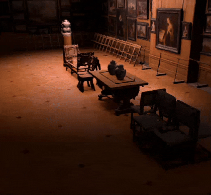
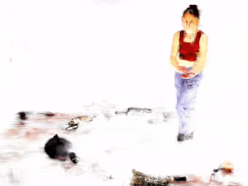
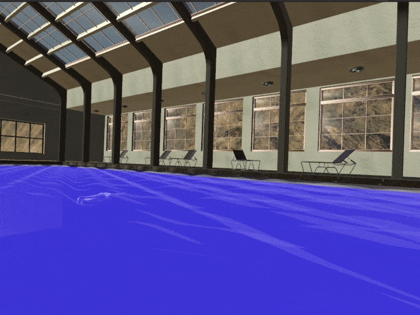
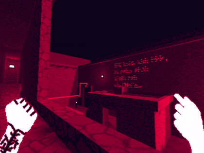

- 💻 I’m interested in systems, graphics programming, GPUs, and virtual reality.
- 🌱 I’m currently pursuing an Master's Degree in Computer Science.
- I am working on a C++ and Vulkan based Gaussian splat engine as well as a traditional game engine! 
- 👀 Take a peak below to see what I've been working on...

